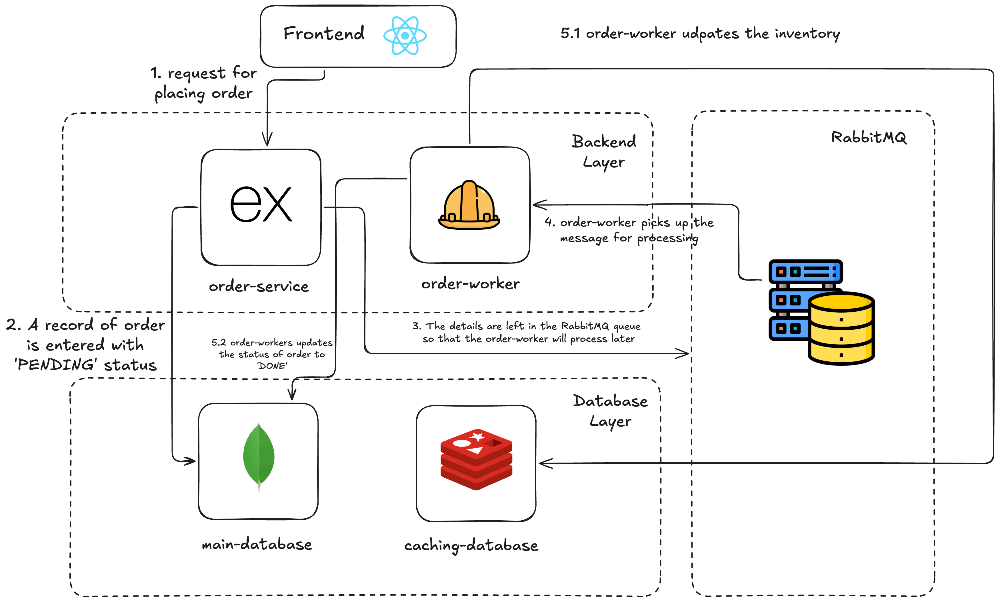

# Implementing AMQP for processing purchase orders 



```
│
├── img/
│
├── order-service/
│   ├── models/
│   │   └── Order.js
│   ├── node_modules/
│   ├── Dockerfile
│   ├── package-lock.json
│   ├── package.json
│   └── server.js
│
├── order-worker/
│   ├── models/
│   │   └── Order.js
│   ├── node_modules/
│   ├── Dockerfile
│   ├── package-lock.json
│   ├── package.json
│   └── worker.js
│
├── docker-compose.yml
│
└── README.md

```


--- 
## Testing the Project

1. Seeding the Inventory

    Too enter the container's cli

    ```
    docker exec -it redis redis-cli
    ```

    Seed the Inventory

    ```
    SET inventory:product1 10
    GET inventory:product1
    ```


2. Creating a Post Request
    ```
    curl -X POST http://localhost:3000/orders \
            -H "Content-Type: application/json" \
            -d '{"productId":"product1","quantity":2}'

    ```
3. Check worker logs

    ```
    docker compose logs -f order-worker
    ```


4. Checking the MongoDB

    To enter the CLI
    ```
    docker exec -it mongodb mongosh
    ```
    To check records
    ```
    use orders
    db.orders.find().pretty()
    ```

5. Check the Reduced Stock

    Too enter the container's cli

    ```
    docker exec -it redis redis-cli
    ```

    Check the Inventory

    ```
    GET inventory:product1
    ```   

Read the Blog here for further details: 